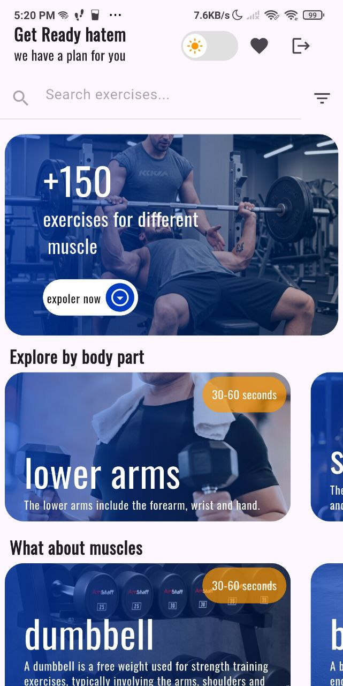
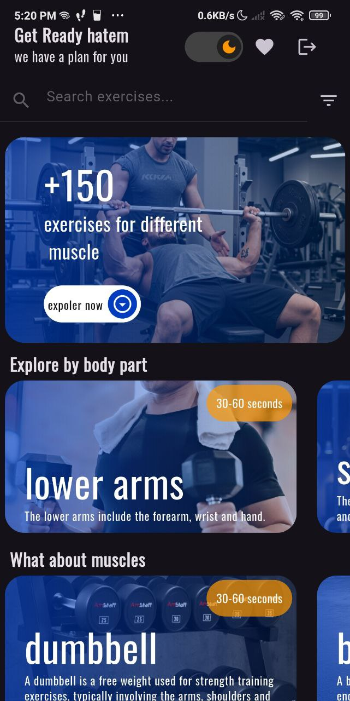
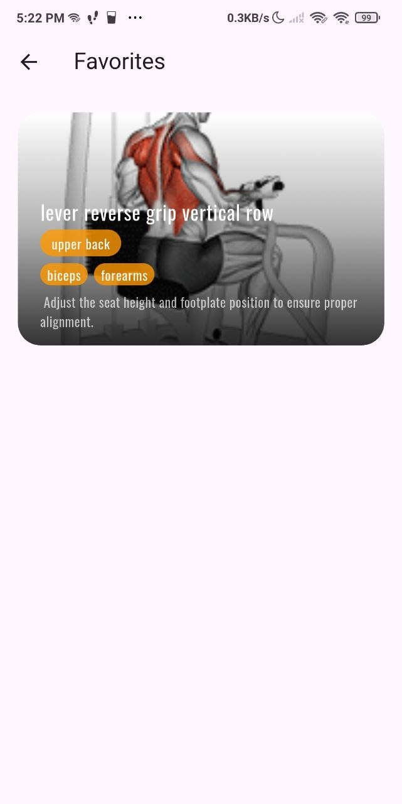
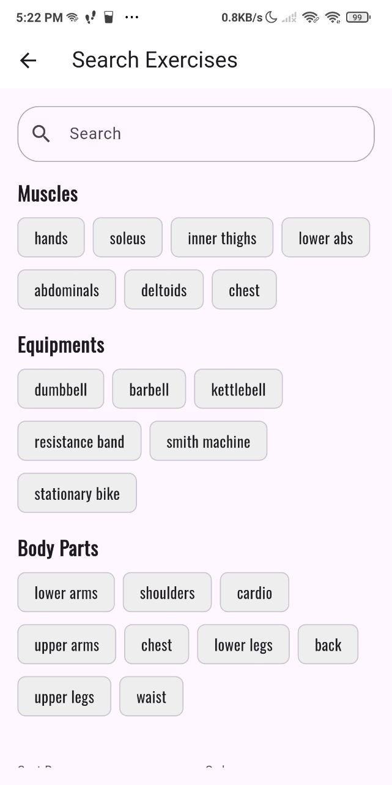

# Gymify#  Gymify - Your Ultimate Fitness Companion

[](https://flutter.dev)
[](https://github.com/your-username/gymify/actions)
[](LICENSE)

Gymify is a **professional Flutter fitness app** for enthusiasts. Access 1,500+ exercises with **advanced filters, offline favorites**, and a **sleek modern UI**.

---

##  App Screenshots







---

##  Features

- **1,500+ Exercises:** Comprehensive database of workouts.
- **Advanced Multi-Filtering:** Body Parts, Target Muscles, Equipment.
- **Smart Search:** Instant search with optimized queries.
- **Offline Favorites:** Save exercises locally using cache.
- **Authentication:** Secure login via **Firebase** (Google & Email/Password).
- **Dark & Light Themes:** Full theme switching with persistent state.
- **Smooth Loading:** **Skeletonizer** for loading placeholders.
- **Responsive Design:** Supports multiple screen sizes using **ScreenUtil**.

---

##  Tech Stack & Architecture

- **State Management:** [Riverpod](https://riverpod.dev/) (AsyncNotifier, Family Providers).
- **Backend/Auth:** [Firebase](https://firebase.google.com/) (Auth & Firestore).
- **Networking:** [Dio](https://pub.dev/packages/dio) with interceptors.
- **Navigation:** [GoRouter](https://pub.dev/packages/go_router) for declarative routing.
- **Local Storage:** [Shared Preferences](https://pub.dev/packages/shared_preferences) for cache.
- **UI:** Flutter ScreenUtil, Skeletonizer, Flutter Switch.

---

##  Technical Notes

###  Asset Strategy
- Exercise filters (Body Parts, Muscles, Equipment) use **PNG assets** to:
  1. Improve visual filtering experience.
  2. Reduce network calls for faster performance.
  3. Guarantee offline availability of icons.

###  Performance & Caching
- **Pagination:** Infinite scrolling to handle large datasets.
- **Favorites:** Cached using SharedPreferences for offline access.

---

##  Getting Started

1. **Clone the repo:**
```bash
git clone https://github.com/your-username/gymify.git
